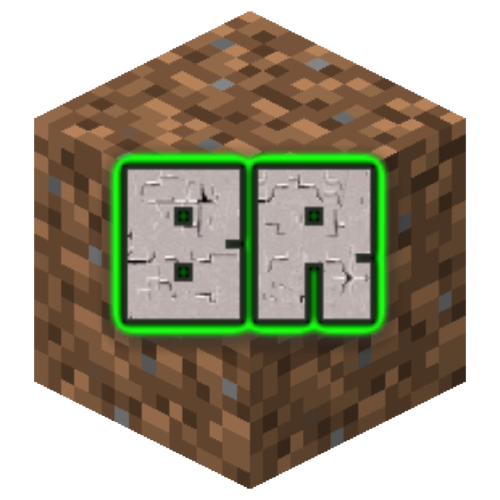
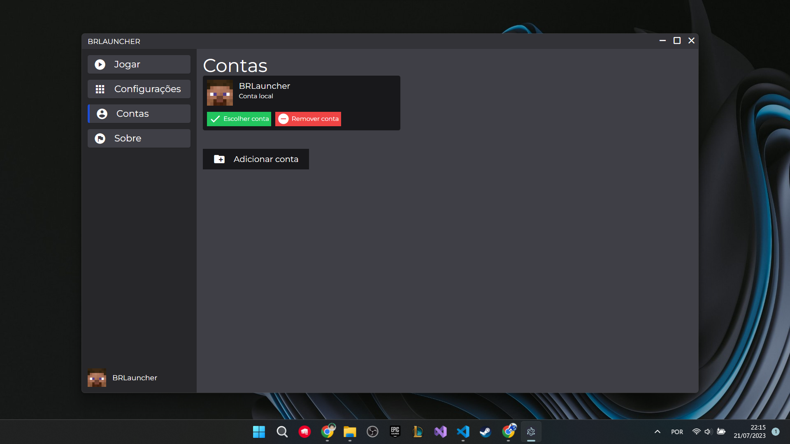
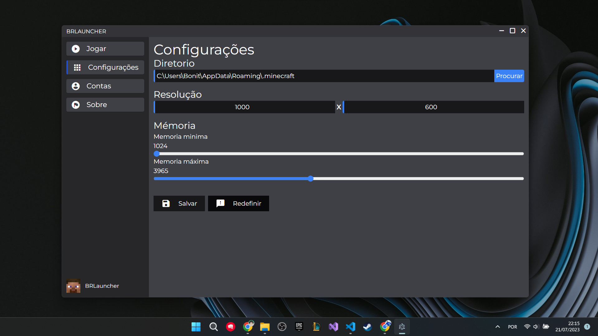

<div style="display: flex; justify-content: center; aling-items: center;">
    
</div>

# BRLauncher

Um launcher de Minecraft 100% Brasileiro, seguro e de código aberto!

## Escolha a versão é jogue


## Gerencie suas contas


## Configure o launcher


## Mostre ao mundo que você usa o melhor


## Instalação 

Siga os passos abaixo para instalar o BRLauncher no seu computador:

### Requisitos do Sistema

Antes de começar, verifique se o seu sistema atende aos seguintes requisitos:

- Sistema Operacional: Windows
- NodeJS: É necessário ter o NodeJS instalado. Recomendamos a versão mais recente.
    - Instalar o NodeJS: https://nodejs.org/pt-br

1. **Baixar o código:** No repositório do BRLauncher, clique no botão "Download ZIP" para baixar o código fonte compactado. Alternativamente, você pode clonar o repositório usando o comando Git:
    - [Onde fica o botão "Download ZIP"?](https://github.com/VOTRON157/BRLauncher/blob/main/.github/images/tutorial.png) 

```bash
git clone https://github.com/VOTRON157/BRLauncher.git # Nesse caso não precisa descompactar, já vai vim a pasta.
```

2. **Extrair os arquivos:** Após o download ser concluído, extraia os arquivos do ZIP em uma pasta de sua escolha  (la é onde ficara a pasta `.minecraft`).

3. **Executar o arquivo `start.bat`:** Navegue até a pasta onde você extraiu os arquivos do launcher. Procure pelo arquivo start.bat e dê um duplo clique nele para executar o BRLauncher.

## Suporte

Caso você encontre problemas na execução, siga estas etapas:

1. **Verificar a versão do NodeJS:** Alguns error podem ocorrer devido a versões obsoletas do Node, para verificar a versão instalada no seu computador você pode executar o seguinte comando:

```bash
node -v
```

# Lista do que fazer

- [ ] Deixar a interface amigavel
- [ ] Opção de customizar a skin
- [ ] Definir o limite de mémoria ram da JVM
- [x] Opção de modificar o Minecraft
    - [x] Forge
    - [x] Fabric
    - [x] Vanilla 
- [x] Guarda os dados do usuario quando ele fechar o Launcher
- [ ] Deixar o código organizado
- [ ] Criar a opção de instalar Mods a partir do próprio launcher.