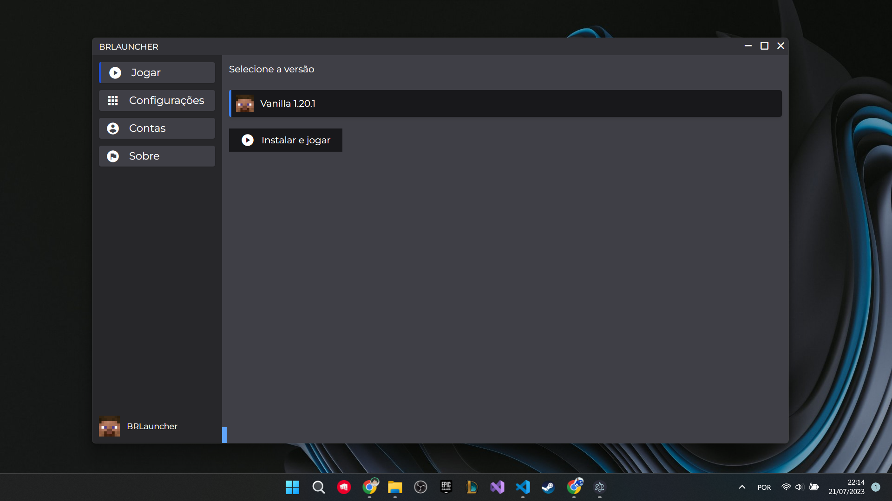

<h1 align="center">
   
  
   
  BRLauncher
   
</h1>

<h4 align="center">Um launcher de Minecraft baseado em <a href="https://www.electronjs.org/" target="_blank">Electron</a>.</h4>

  <a href="#introdução">Introdução</a> •
  <a href="#instalação">Instalação</a> •
  <a href="#créditos">Créditos</a> •
  <a href="#licensa">Licensa</a>

## Introdução

É importante informar a todos os usuários deste launcher de Minecraft que o mesmo é uma criação independente e não possui qualquer vínculo oficial com a Mojang AB, nem com suas propriedades intelectuais, incluindo o jogo Minecraft.  Ressaltamos que o uso deste launcher é opcional, e os jogadores devem estar cientes de que a Mojang AB não assume nenhuma responsabilidade por quaisquer problemas ou conflitos que possam surgir ao utilizar esta plataforma não oficial.

## Instalação

Para rodar esse launcher em seu computador, você precisa baixar o instalador, que está diponivel no [releases](https://github.com/VOTRON157/BRLauncher/releases)

> **Nota**
> Se você estiver usando outro sistema operacional sem ser Windows, você deve compilar esse projeto por conta prórpia.

## Créditos

O sistema de trocar de páginas através do id foi baseado no [Selvania Launcher](https://github.com/luuxis/Selvania-Launcher). por mais que eu tenha escrito todo o código, apenas gostei de idea de poder alternar entre as páginas.

**Tecnologias utilizadas**

- [Electron](https://www.electronjs.org/)
- [Node.js](https://nodejs.org/)

## Licensa

MIT