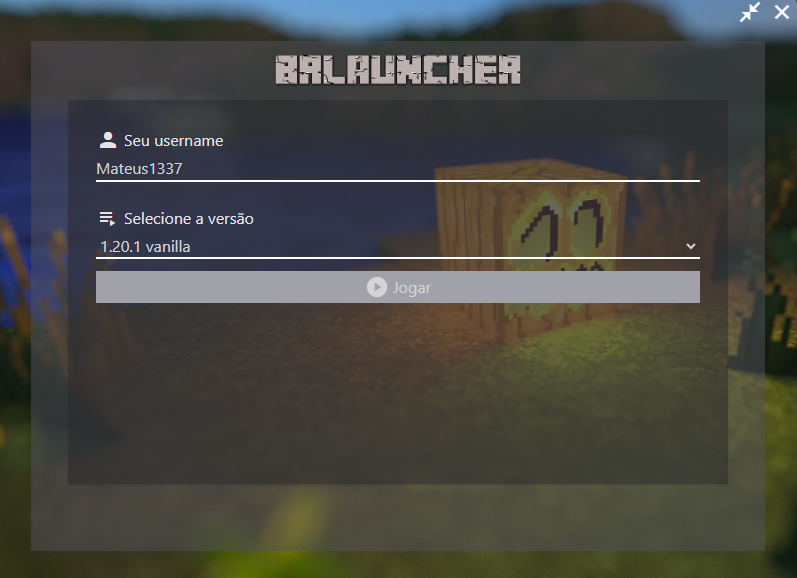

<div style="display: flex; justify-content: center; aling-items: center;">
    
</div>

# BRLauncher

Um launcher de Minecraft 100% Brasileiro, seguro e de código aberto!

## Como instalar

Para instalar esse launcher no seu computador siga as seguintes etapas:

🚨 LEMBRE-SE DE INSTALAR O JAVA E O NODEJS

### Clonar o projeto

1. Baixar o código

Primeiramente você precisa baixar o código fonte para seu computador, você pode fazer isso assim:

```bash
git clone https://github.com/VOTRON157/BRLauncher.git
cd BRLauncher
```

Se você não tiver o git instalado, você pode baixar através do proprio github:


E abra a pasta com os arquivos no terminal, igual a gente fez no primeiro exemplo (usando o git).

2. Instalar os pacotes

Para conseguimos rodar o código precisamos instalar as blibiotecas, primeiro entre na pasta onde está o código fonte através de um terminal.

~~a pasta deve ter isso, ou algo parecido com isso dentro~~


~~como abrir uma pasta no terminal usando windows:~~


Depois de ter feito isso, digite os seguintes comandos (na pespectiva ordem) no terminal:

```bash
npm install
npm run build:css
# Esse primeiro e segundo comando só é necessario na primeira vez que você for abrir.
npm start
```

Uma janela ira se abrir e você já podera usar o launcher!

